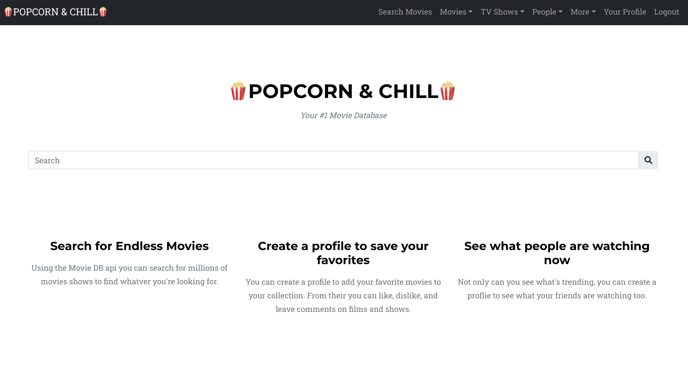
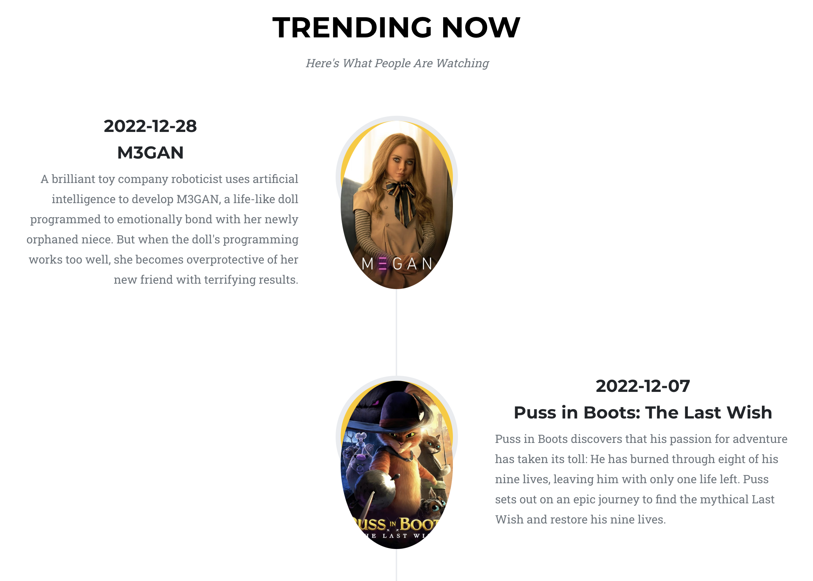
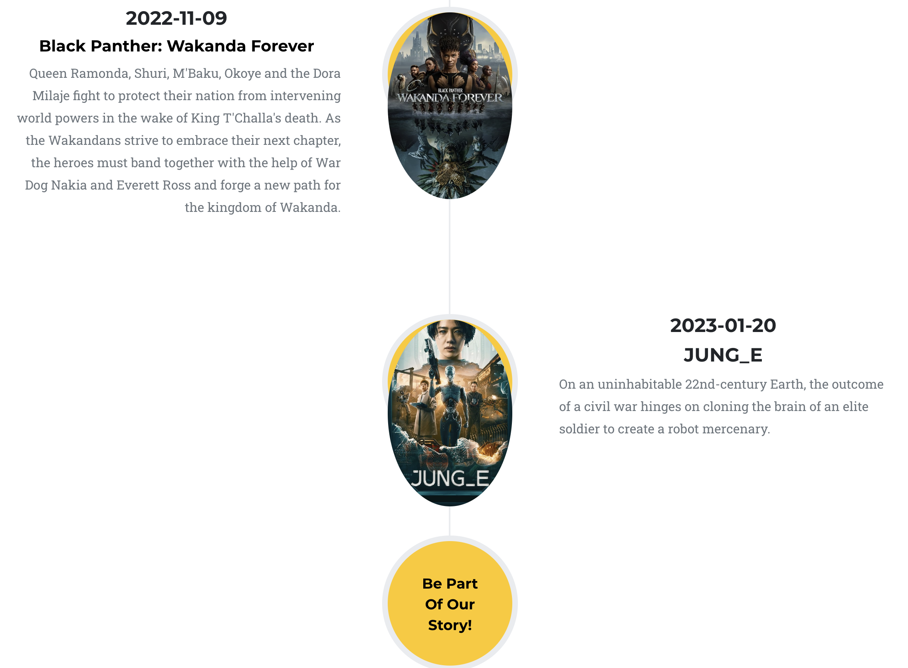
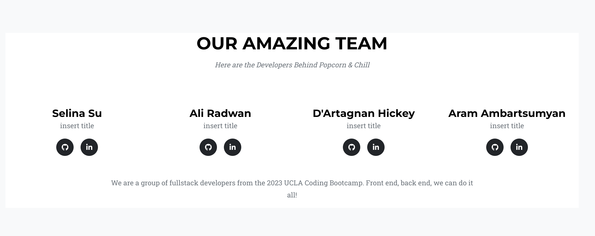
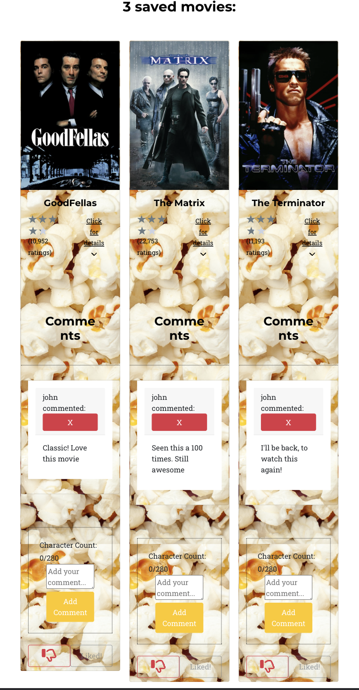

# Popcorn Chill

## Description

Popcorn N Chill is an application where users can search from a variety of movies and tv-shows, and save them to their personal profile page. There they can see their saved movie or tv-show descriptions and ratings, along with comments made by other users. It is a social media app for the movie and tv buff.

## Table Of Contents 

* [Description](#description)
* [User Story](#user-story)
* [Usage](#Usage)
* [Mock Up](#mock-up)
* [Heroku](#heroku)
* [GitHub Repository](#github-repository)
* [Contributors](#Contributors)

## User Story

As a user I want to able to access all of my favorite movies and tv-shows in one app. Popcorn N Chill allows me to never forget the titles, descriptions, and ratings of all of my favorites. I can always look back for reference, and see the comments and how each film or show has impacted not only myself but other users. 

## Usage

* Mern Stack
* Apollo Server
* GraphQL

## Mock Up

## Profile

## Heroku

## GitHub Repository
https://github.com/alisradwan/Popcorn-Chill

## Contributors

* Selina Su https://github.com/fuuko08
* Ali Radwan https://github.com/alisradwan
* D`artagnan Hickey https://github.com/SaintMartyrn
* Aram Ambartsumyan https://github.com/AramA89